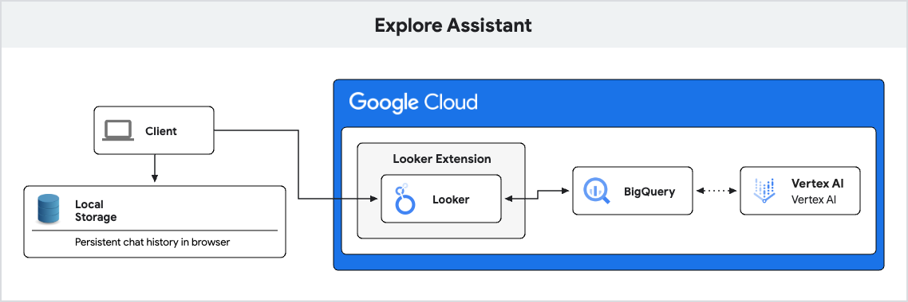

## Explore Assistant Extension BigQuery Deployment
This documentation outlines the steps required to deploy the Explore Assistant Extension with BigQuery as the backend for generating Explore URL's based on Natural Language. It assumes a Looker Instance is available with a suitable LookML Model and Explore configured. **To Note:** this only requires setting up BQ for the LLM integration. Any database connected to Looker can still be queried against.

### 1. LLM Integration

This section describes how to set up the LLM Integration for the Explore Assistant. TLDR; We use a remote connection via BigQuery to the Gemini model on Vertex to generate the Explore URL and return the results to the frontend.

#### Getting Started for Development
Terraform deployment coming soon!



1. Clone or download a copy of this repository to your development machine. Ensure that `gcloud` cli is configured.
   If you have a git ssh_config:
   ```bash
   # cd ~/ Optional. your user directory is usually a good place to git clone to.
   git clone git@github.com:LukaFontanilla/looker-explore-assistant.git
   ```

   If not:
   ```bash
   # cd ~/ Optional. your user directory is usually a good place to git clone to.
   git clone https://github.com/LukaFontanilla/looker-explore-assistant.git
   ```

   Alternatively, open up this repository in: &nbsp;
   [](https://shell.cloud.google.com/cloudshell/editor?cloudshell_git_repo=https://github.com/LukaFontanilla/looker-explore-assistant.git&cloudshell_workspace=explore-assistant-extension/extension-bigquery-deployment)


2.  Before running the following commands, ensure that either your user or the service account being used to execute the following has the permissions described in [this documentation](https://cloud.google.com/bigquery/docs/generate-text#required_permissions).

3.  Run the following gcloud commands to provision the appropriate IAM, swapping `PROJECT_NUMBER` with your GCP Project number & `MEMBER` with the service account ID described below.
    Ensure Looker Service Account has `bigquery_conection_user` permissions. For Looker Original the service account will be the service account for the BigQuery connection setup with Looker. For Looker Core this will be the default service account provisioned through ADC in the format of `service-<project-number>@gcp-sa-looker.iam.gserviceaccount.com`.
    ```bash
    gcloud projects add-iam-policy-binding 'PROJECT_NUMBER' --member='serviceAccount:MEMBER' --role='roles/bigquery.connectionUser' --condition=None
    ```
4.  Provisioning a BigQuery Remote Connection for LLM access. Please replace `REGION` with the [connection region](https://cloud.google.com/bigquery/docs/locations#supported_regions) and `PROJECT_ID` with your GCP Project.
    ```bash
    bq mk --connection --location=REGION --project_id=PROJECT_ID \
    --connection_type=CLOUD_RESOURCE explore_assistant_llm
    ```
5.  Copy the provided Service Account for the Remote connection. Filing in the `REGION` and `PROJECT_ID` variables from the previous step.
    ```bash
    bq show --connection PROJECT_ID.REGION.explore_assistant_llm
    ```
    And grant it the `vertex_ai_user` role. `MEMBER` will be the service account id returned from the above command.
    ```bash
    gcloud projects add-iam-policy-binding 'PROJECT_NUMBER' --member='serviceAccount:MEMBER' --role='roles/aiplatform.user' --condition=None
    ```
6.  From either the BigQuery console or your Looker Instance's SQL Runner Tab, execute the following commands:
    Create a dataset in your BigQuery instance called `explore_assistant`. Please replace the following variables with those for you environment (`PROJECT_ID`,`REGION`)
    ```sql
        CREATE SCHEMA IF NOT EXISTS `PROJECT_ID.explore_assistant`
        OPTIONS(location = 'REGION')
    ```
    Create a remote model connection to `gemini-pro`. Please replace the following variables with those for you environment (`PROJECT_ID`,`REGION`). The remote model and connection will be named
    the same (`explore_assistant_llm`) for simplicity.
    ```sql
        CREATE OR REPLACE MODEL
        `PROJECT_ID.explore_assistant.explore_assistant_llm`
        REMOTE WITH CONNECTION `PROJECT_ID.REGION.explore_assistant_llm`
        OPTIONS (ENDPOINT = 'gemini-pro');
    ```
    Execute the following command to create a table in that dataset called `explore_assistant_examples` to hold the examples for each explore. This will serve as a lookup table.
    ```sql
        CREATE OR REPLACE TABLE `explore_assistant.explore_assistant_examples` (
            explore_id STRING OPTIONS (description = 'Explore id of the explore to pull examples for in a format of -> lookml_model:lookml_explore'),
            examples STRING OPTIONS (description = 'Examples for Explore Assistant training. Multi line string of input: ,output: \n')
        )
    ```
    Copy Stringified Examples and set them as variable in BQ. (**NOTE:** Examples below are standard ecomm examples used to illustrate the structure, you will need to copy in those relevant to your environment. Please see this notebook for more details on generating these: <a target="_blank" href="https://colab.research.google.com/github/LukaFontanilla/looker-explore-assistant/blob/main/explore-assistant-training/looker_explore_assistant_training.ipynb">
    
    </a>
    ```sql
        DECLARE examples STRING;
        SET examples = """
        input: customer with lifetime revenue > 100
        output :fields=user_order_facts.lifetime_revenue&f[user_order_facts.lifetime_revenue]=>100&sorts=user_order_facts.lifetime_revenue desc 0&limit=500
        input : Customer who are currently active and made an order in the last day 30 days
        output :fields=users.email,order_items.created_date&f[user_order_facts.currently_active_customer]=Yes&f[order_items.created_date]=last 30 days&sorts=order_items.created_date desc
        input: What s the total sales of brand Calvin Klein?
        output:fields=order_items.total_sale_price&f[products.brand]=Calvin Klein&vis={\"type\":\"single_value\"}
        input: Orders that are still in Processing after 3 days, filtered by Distribution Center
        output:fields=order_items.created_date,order_items.order_id,products.item_name,order_items.status,users.email,order_items.average_days_to_process&f[distribution_centers.name]=Chicago IL&f[order_items.created_date]=before 3 days ago&f[order_items.status]=Processing&sorts=order_items.created_date desc&column_limit=50&vis={\"type\":\"looker_grid\"}"""
    ```
    Insert these examples with the Looker explore id (ie. model:explore; replacing "model" with the lookml model and "explore" with the lookml explore) into the `explore_assistant` table.
    ```sql
        INSERT INTO explore_assistant.explore_assistant_examples (explore_id,examples)
        VALUES ('model:explore',examples);
    ```
)


### 2. Looker Extension Framework Setup
**Important** If you are not familiar with the Looker Extension Framework, please review [this documentation](https://developers.looker.com/extensions/overview/) first before moving forward.


#### Getting Started for Development

1. From the Explore Assistant root directory (`cd`) to the Explore Assistant Extension BigQuery Deployment folder. Skip this step if deploying from Cloud Shell method above.

   ```bash
   cd explore-assistant-extension/extension-bigquery-deployment
   ```

1. Install the dependencies with [NPM](https://docs.npmjs.com/downloading-and-installing-node-js-and-npm). *Please follow the hyperlinked directions for installing node and npm on your machine. If deploying from Cloud Shell you may skip this step.* Additionally if you need to work across multiple Node versions, `nvm` can be used switch between and install different node versions.

   ```bash
   npm install
   ```

   > You may need to update your Node version or use a [Node version manager](https://github.com/nvm-sh/nvm) to change your Node version.

1. Ensure all the appropriate environment variables are set.

   ```
   LOOKER_MODEL=<This is your Looker model name>
   LOOKER_EXPLORE=<This is your Looker explore name>
   BQML_MODEL_ID=<This is your BQML model name from the prior step formatted as dataset.model_name>
   ```

1. Start the development server
   **IMPORTANT** If you are running the extension from a VM or another remote machine, you will need to Port Forward to the machine where you are accessing the Looker Instance from (ie. if you are accessing Looker from your local machine, run the following command there). Here's a boilerplate example for port forwarding the remote port 8080 to the local port 8080:
   `ssh username@host -L 8080:localhost:8080`.

   ```bash
   npm run start
   ```

   Great! Your extension is now running and serving the JavaScript at https://localhost:8080/bundle.js.

1. Now log in to Looker and create a new project or use an existing project.

   This is found under **Develop** => **Manage LookML Projects** => **New LookML Project**.

   You'll want to select "Blank Project" as your "Starting Point". You'll now have a new project with no files.

   1. In your copy of the extension project you have a `manifest.lkml` file.

   You can either drag & upload this file into your Looker project, or create a `manifest.lkml` with the same content. Change the `id`, `label`, or `url` as needed. 
   **IMPORTANT** please paste in the deployed Cloud Function URL into the `external_api_urls` list. This will allowlist it in Looker for fetch requests.

   ```lookml
   application: explore-assistant {
    label: "Explore Assistant"
    # file: "bundle.js"
    url: "https://localhost:8000/bundle.js"
    entitlements: {
        core_api_methods: ["lookml_model_explore","run_inline_query","create_sql_query","run_sql_query"]
        navigation: yes
        use_embeds: yes
        use_iframes: yes
        new_window: yes
        new_window_external_urls: ["https://developers.generativeai.google/*"]
        local_storage: yes
    }
    }
   ```

1. Create a `model` LookML file in your project. The name doesn't matter. The model and connection won't be used, and in the future this step may be eliminated.

   - Add a connection in this model. It can be any connection, it doesn't matter which.
   - [Configure the model you created](https://docs.looker.com/data-modeling/getting-started/create-projects#configuring_a_model) so that it has access to some connection.

1. Connect your new project to Git. You can do this multiple ways:

   - Create a new repository on GitHub or a similar service, and follow the instructions to [connect your project to Git](https://docs.looker.com/data-modeling/getting-started/setting-up-git-connection)
   - A simpler but less powerful approach is to set up git with the "Bare" repository option which does not require connecting to an external Git Service.

1. Commit your changes and deploy your them to production through the Project UI.

1. Reload the page and click the `Browse` dropdown menu. You should see your extension in the list.
   - The extension will load the JavaScript from the `url` provided in the `application` definition. By default, this is https://localhost:8080/bundle.js. If you change the port your server runs on in the package.json, you will need to also update it in the manifest.lkml.
   - Refreshing the extension page will bring in any new code changes from the extension template, although some changes will hot reload.

#### Deployment

The process above requires your local development server to be running to load the extension code. To allow other people to use the extension, a production build of the extension needs to be run. As the kitchensink uses code splitting to reduce the size of the initially loaded bundle, multiple JavaScript files are generated.

1. In your extension project directory on your development machine, build the extension by running the command `npm run build`.
2. Drag and drop ALL of the generated JavaScript file (ie. `bundle.js`) contained in the `dist` directory into the Looker project interface.
3. Modify your `manifest.lkml` to use `file` instead of `url` and point it at the `bundle.js` file.

Note that the additional JavaScript files generated during the production build process do not have to be mentioned in the manifest. These files will be loaded dynamically by the extension as and when they are needed. Note that to utilize code splitting, the Looker server must be at version 7.21 or above.

---