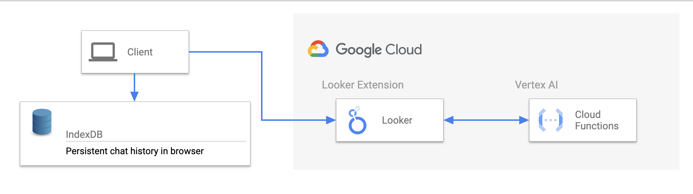
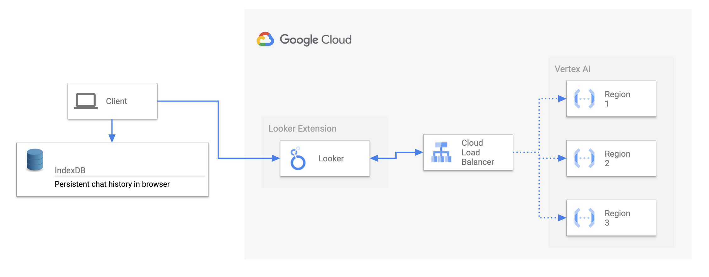

## Explore Assistant Extension Cloud Function Deployment
This documentation outlines the steps required to deploy the Explore Assistant Extension with Cloud Functions as the backend for generating Explore URL's based on Natural Language. It assumes a Looker Instance is available with a suitable LookML Model and Explore configured. **To Note:** The Cloud Function is going to be deployed as public endpoint by default. However it will only be accessible in the browser by users with permissions to your Looker instance. For different options for securing the endpoint, please see the **Security** section below.

### 1. LLM Integration

This section describes how to set up the LLM Integration for the Explore Assistant. TLDR; We use a 2nd Gen Cloud Function to call the foundational model and return the results to the frontend.

#### Getting Started for Development



1. Clone or download a copy of this repository to your development machine.
   If you have a git ssh_config:
   ```bash
   # cd ~/ Optional. your user directory is usually a good place to git clone to.
   git clone git@github.com:LukaFontanilla/looker-explore-assistant.git
   ```

   If not:
   ```bash
   # cd ~/ Optional. your user directory is usually a good place to git clone to.
   git clone https://github.com/LukaFontanilla/looker-explore-assistant.git
   ```
   Alternatively, open up this repository in: &nbsp;
   [](https://shell.cloud.google.com/cloudshell/editor?cloudshell_git_repo=https://github.com/LukaFontanilla/looker-explore-assistant.git&cloudshell_workspace=explore-assistant-extension/extension-cloud-function-deployment)

2. Navigate (`cd`) to the template directory on your system. Skip this step if deploying from Cloud Shell method above.

   ```bash
   cd looker-explore-assistant/explore-assistant-extension/extension-cloud-function-deployment/cloud-function/terraform
   ```

3. Replace defaults in the `variables.tf` file for project and region.

4. Ensure that [Terraform](https://developer.hashicorp.com/terraform/tutorials/aws-get-started/install-cli) is installed on your machine. Then Deploy resources.

   Initialize Terraform
   ```terraform
   terraform init
   ```

   Plan resource provisioning
   ```
   terraform plan
   ```

   Provision Resources
   ```
   terraform apply
   ```

5. Save/Copy Deployed Cloud Function URL Endpoint(s). This will be used at a later step.

#### Optional: Deploy regional endpoints and load balance traffic from Looker



Please see this resource for more information on how to deploy regional endpoints and load balance traffic from Looker: https://cloud.google.com/load-balancing/docs/https/setting-up-https-serverless

#### Optional: Setup Log Sink to BQ for LLM Cost Estimation and Request Logging

Please see [Google Cloud's docs](https://cloud.google.com/logging/docs/export/configure_export_v2#creating_sink) on setting up a log sink to BQ, using the below filter for Explore Assistant Logs:

```
(resource.type = "cloud_function"
resource.labels.function_name = "Insert service name"
resource.labels.region = "<Insert location>")
 OR 
(resource.type = "cloud_run_revision"
resource.labels.service_name = "<Insert service name>"
resource.labels.location = "<Insert location>")
 severity>=DEFAULT
jsonPayload.component="explore-assistant-metadata"
```

#### Security

The deployed Cloud Function will be public by default. This is because historically a Looker instance hasn't had a mechanism to authenticate to GCP services. To secure this endpoint there will be a few options and they will be dependent on your environment and needs:

* [Low Lift] Keep public and allowlist the extension URL in the [function via CORS](https://flask-cors.readthedocs.io/en/latest/)
* [Low Lift] Simple [access token](https://flask-cors.readthedocs.io/en/latest/) based authentication (store token in Looker check in the function)
* [Medium Lift] Use proxy, either load balancer or api gateway and keep function private (ie. [internal traffic only](https://cloud.google.com/functions/docs/networking/network-settings#:~:text=Traffic%20to%20a%20Cloud%20Functions,Shared%20VPC%20networks%20is%20denied.)).


### 2. Looker Extension Framework Setup
**Important** If you are not familiar with the Looker Extension Framework, please review [this documentation](https://developers.looker.com/extensions/overview/) first before moving forward.


#### Getting Started for Development

1. From the Explore Assistant root directory (`cd`) to the Explore Assistant Extension Cloud Function Deployment folder.

   ```bash
   cd explore-assistant-extension/extension-cloud-function-deployment
   ```

1. Install the dependencies with [NPM](https://docs.npmjs.com/downloading-and-installing-node-js-and-npm). *Please follow the hyperlinked directions for installing node and npm on your machine. Skip this step if deploying from Cloud Shell method above.* Additionally if you need to work across multiple Node versions, `nvm` can be used switch between and install different node versions.

   ```bash
   npm install
   ```

   > You may need to update your Node version or use a [Node version manager](https://github.com/nvm-sh/nvm) to change your Node version.

1. Ensure all the appropriate environment variables are set.

   ```
   VERTEX_AI_ENDPOINT=<This is your Deployed Cloud Function Endpoint>
   LOOKER_MODEL=<This is your Looker model name>
   LOOKER_EXPLORE=<This is your Looker explore name>
   ```

1. Start the development server
   **IMPORTANT** If you are running the extension from a VM or another remote machine, you will need to Port Forward to the machine where you are accessing the Looker Instance from (ie. If you are accessing Looker from your local machine, run the following command there.). Here's a boilerplate example for port forwarding the remote port 8080 to the local port 8080:
   `ssh username@host -L 8080:localhost:8080`.

   ```bash
   npm run start
   ```

   Great! Your extension is now running and serving the JavaScript at https://localhost:8080/bundle.js.

1. Now log in to Looker and create a new project or use an existing project.

   This is found under **Develop** => **Manage LookML Projects** => **New LookML Project**.

   You'll want to select "Blank Project" as your "Starting Point". You'll now have a new project with no files.

   1. In your copy of the extension project you have a `manifest.lkml` file.

   You can either drag & upload this file into your Looker project, or create a `manifest.lkml` with the same content. Change the `id`, `label`, or `url` as needed. 
   **IMPORTANT** please paste in the deployed Cloud Function URL into the `external_api_urls` list. This will allowlist it in Looker for fetch requests.

   ```lookml
   application: explore_assistant {
    label: "Explore Assistant"
    url: "https://localhost:8080/bundle.js"
    # file: "bundle.js"
    entitlements: {
      core_api_methods: ["lookml_model_explore"]
      navigation: yes
      use_embeds: yes
      use_iframes: yes
      new_window: yes
      new_window_external_urls: ["https://developers.generativeai.google/*"]
      local_storage: yes
      external_api_urls: ["cloud function url"]
    }
   }
   ```

1. Create a `model` LookML file in your project. The name doesn't matter. The model and connection won't be used, and in the future this step may be eliminated.

   - Add a connection in this model. It can be any connection, it doesn't matter which.
   - [Configure the model you created](https://docs.looker.com/data-modeling/getting-started/create-projects#configuring_a_model) so that it has access to some connection.

1. Connect your new project to Git. You can do this multiple ways:

   - Create a new repository on GitHub or a similar service, and follow the instructions to [connect your project to Git](https://docs.looker.com/data-modeling/getting-started/setting-up-git-connection)
   - A simpler but less powerful approach is to set up git with the "Bare" repository option which does not require connecting to an external Git Service.

1. Commit your changes and deploy your them to production through the Project UI.

1. Reload the page and click the `Browse` dropdown menu. You should see your extension in the list.
   - The extension will load the JavaScript from the `url` provided in the `application` definition. By default, this is https://localhost:8080/bundle.js. If you change the port your server runs on in the package.json, you will need to also update it in the manifest.lkml.
   - Refreshing the extension page will bring in any new code changes from the extension template, although some changes will hot reload.

#### Deployment

The process above requires your local development server to be running to load the extension code. To allow other people to use the extension, a production build of the extension needs to be run. As the kitchensink uses code splitting to reduce the size of the initially loaded bundle, multiple JavaScript files are generated.

1. In your extension project directory on your development machine, build the extension by running the command `npm run build`.
2. Drag and drop ALL of the generated JavaScript file (ie. `bundle.js`) contained in the `dist` directory into the Looker project interface.
3. Modify your `manifest.lkml` to use `file` instead of `url` and point it at the `bundle.js` file.

Note that the additional JavaScript files generated during the production build process do not have to be mentioned in the manifest. These files will be loaded dynamically by the extension as and when they are needed. Note that to utilize code splitting, the Looker server must be at version 7.21 or above.

---